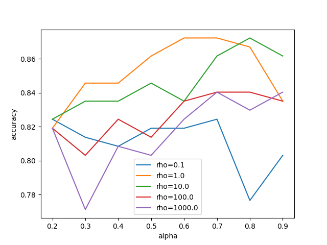

# Fused Unbalanced Gromov-Wasserstein (FUGW) solver 

This repository proposes a custom implementation of the the Fused Unbalanced Gromov-Wasserstein (FUGW) solver based on the methodology presented in "Aligning individual brains with Fused Unbalanced Gromov-Wasserstein," accessible at [arXiv:2206.09398](https://arxiv.org/abs/2206.09398).

**Disclaimer:** The implementation found here prioritizes conceptual clarity over computational efficiency. For a high-performance version, consider using the optimized solver available at [alexisthual/fugw on GitHub](https://github.com/alexisthual/fugw).

## About the FUGW Solver

The FUGW distance is an improvement over the Fused Gromov-Wasserstein distance ([arXiv:1811.02834](https://arxiv.org/abs/1811.02834)), where we relax the hard marginal constraints into soft ones. The solver's code can be found within the `fugw_solver` directory of this repository.

### Utilizing the Solver

To use the solver, invoke the `solver` function as demonstrated below. 

```python
from fugw_solver.solver import solver

solver(source_features, target_features, source_geometry, target_geometry, w_s=None, w_t=None, device="cpu", nits_bcd=10, nits_uot=1000, alpha=0.5, rho=1, eps=1e-2)
```

### Getting Started with Examples

#### Graph Matching

The script `graph_fugw_utility.py` provides a simple introduction to the utility of the unbalance term in FUGW.


*An illustrative example showing the transport problem solved by the FUGW, highlighting the unbalance term's effectiveness.*

#### Applying FUGW in k-NN Graph Classification

We used a k-NN algorithm with the FUGW distance to perform a graph classification task on the MUTAG dataset. The file `mutag_classif.py` computes the Leave-One-Out accuracy for several values of alpha, rho and k. The file `mutag_results.ipynb` displays the results and the file `mutag_draw.ipynb` contains some illustrations of the problem, which highlights the utility of FUGW.


*Visual analysis of classification performance across different settings of alpha and rho.*

